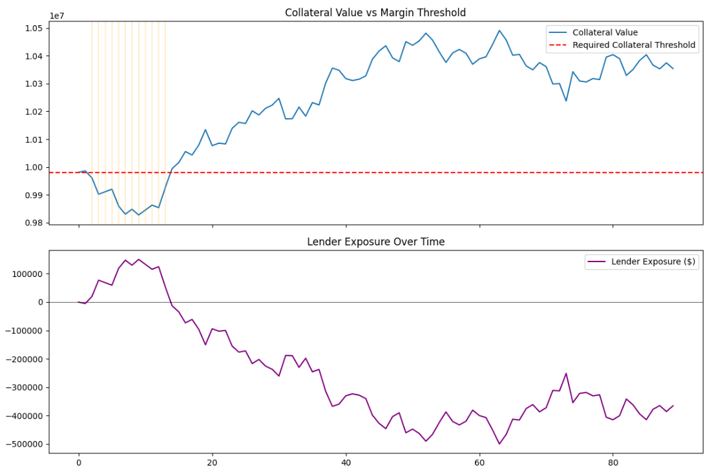

# Repo Collateral & Margin Call Simulator

**A simulation of repo (repurchase agreement) financing mechanics — daily collateral mark-to-market, haircut-adjusted margin thresholds, margin call detection, lender exposure tracking, and collateral cure logic.**

`Python` `NumPy` `pandas` `matplotlib`

---

## Overview

Repo financing desks manage collateralized short-term lending positions where the value of posted collateral must be continuously monitored against market movements. This project simulates that core operational workflow end-to-end: pricing a bond used as collateral, tracking its value as yields move, detecting when a margin call would be triggered, quantifying the lender's real-time credit exposure, and modeling how a borrower cures a shortfall.

## Background: What Is a Repo Trade?

A repurchase agreement ("repo") is a short-term, collateralized loan structured as a sale-and-buyback of a security:

1. The **borrower** sells a bond to the **lender** for cash today.
2. Both parties agree the borrower will **repurchase** the bond later at a slightly higher price — the difference is the implicit interest (repo rate).
3. The lender holds the bond as **collateral** for the life of the trade.

Because collateral value fluctuates daily with market yields, it is **marked to market** continuously. If its value falls too far — after adjusting for a **haircut** (a safety buffer the lender applies upfront) — the lender issues a **margin call**, requiring the borrower to post additional collateral to restore adequate coverage.

## Methodology

| Step | What Was Built | Why It Matters |
|------|-----------------|-----------------|
| 1. Bond Pricing | Priced a bond from first principles — PV of coupon payments + PV of face value at maturity | Gives collateral's true market value at any point, as a function of yield |
| 2. Yield Simulation | Simulated a 90-day yield path via random walk (5bp daily volatility) | Represents evolving market conditions driving collateral value |
| 3. Trade Setup | $10mm face value, 10Y maturity, 5% coupon bond; 2% haircut | Establishes the loan amount and minimum required collateral threshold |
| 4. Margin Call Detection | Flagged every day collateral value fell below the required threshold | Core mechanical event the desk monitors daily |
| 5. Lender Exposure | Computed potential loss on borrower default at each point in time | Distinct risk metric from margin calls; validated the two align |
| 6. Cure Logic | Simulated borrower posting additional collateral to cure shortfalls | Completes the trade lifecycle, not just point-in-time detection |

## Results

- Margin calls clustered during an early yield uptick (days ~1–13), when collateral value dropped below the required threshold
- Lender exposure peaked around **+$150,000** during that window, then turned negative (over-collateralized) as collateral value recovered
- Total additional collateral posted to cure all shortfalls over the 90-day simulation: **$153,453**



*Top: collateral value (blue) vs. the fixed required threshold (red dashed); orange lines mark margin call days. Bottom: lender's dollar exposure over the same period — positive when under-collateralized, negative when over-collateralized.*

## Key Design Decisions

- **Spread/exposure isolated from rate noise:** collateral value is repriced using the full bond pricing formula rather than a linear approximation, so the simulation reflects true price-yield convexity, not just a rough estimate.
- **Random walk yield path:** a deliberate simplification for a mechanics-focused simulation. A production model would use a mean-reverting stochastic process (e.g. Vasicek) or real historical yield data.
- **Fixed threshold at trade inception:** required collateral is set once at trade start based on the haircut, consistent with how real repo agreements lock in terms at inception rather than continuously renegotiating them.

## Limitations & Next Steps

- Single bond, single trade — a real financing desk manages a portfolio of repo/TRS positions concurrently
- Simplified cure mechanics — real repo agreements include minimum transfer amounts and negotiated grace/cure periods not modeled here
- No reverse case modeled — some agreements allow the borrower to reclaim excess collateral if value rises significantly
- **Natural extensions:** multi-bond portfolio aggregation, Total Return Swap (TRS) cash flow mechanics, or replacing the simulated yield path with real historical data

## Repository Structure

```
repo-margin-call-simulator/
├── repo_margin_call_simulator.py   # main script
├── requirements.txt
├── outputs/
│   ├── yield_path.png
│   ├── margin_calls_exposure.png
│   ├── margin_calls.csv
│   └── simulation_summary.csv
└── README.md
```

## How to Run

```bash
pip install -r requirements.txt
python repo_margin_call_simulator.py
```

## Tech Stack

Python · NumPy · pandas · matplotlib
